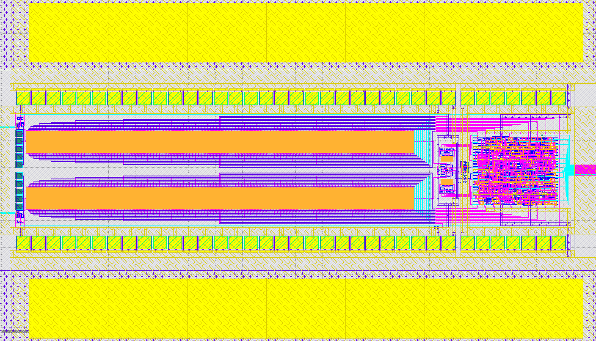
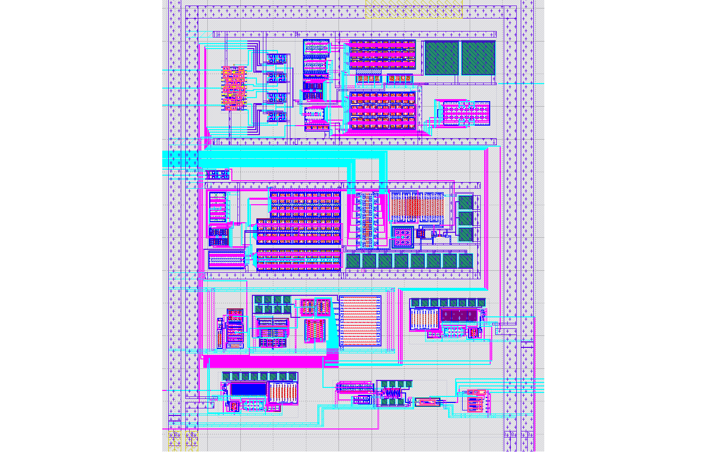

# 10 bit SAR-ADC + Analog Circuits

This submission features:

- 10b SAR-ADC on powered from external supply.
- 10b SAR-ADC powered from internal regulators.
- Bandgap reference.
- Testbuffer with multiplexer input.
- Clock generator
- 2 linear regulators, 1.2V and 1.5V.
- Bias current/voltage generator.

Included are:

- Hierachical GDS of the whole layout with all individual blocks.
- Schematics for all parts of the layout.
- Testbenches for all the individual blocks.
- Simulation corners setups for process corner simulations.

# Schematics

Simply source cadrc in the xschem folder and execute 
xschem afterwards to get an full overview.

# Layout

