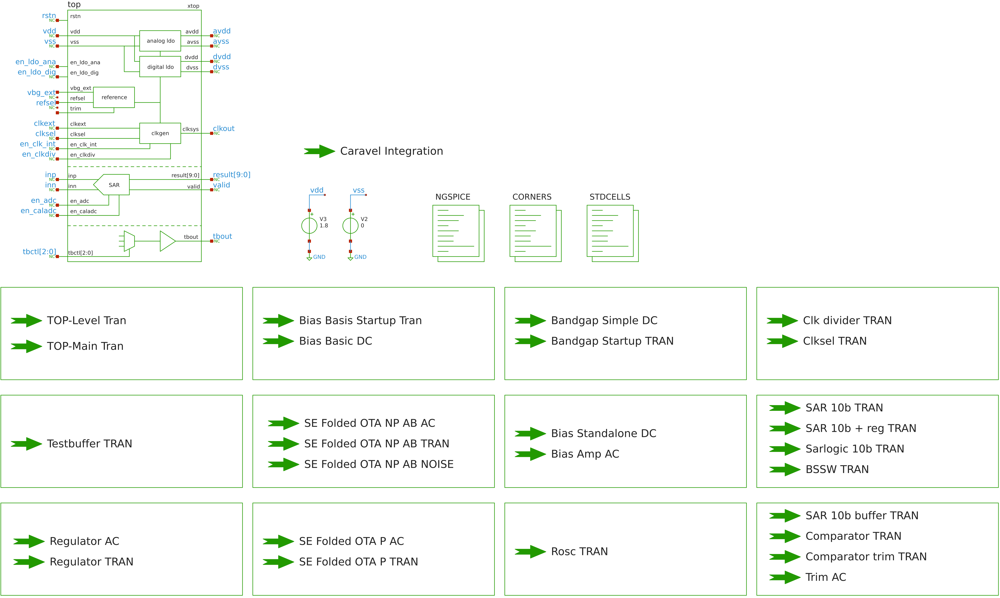
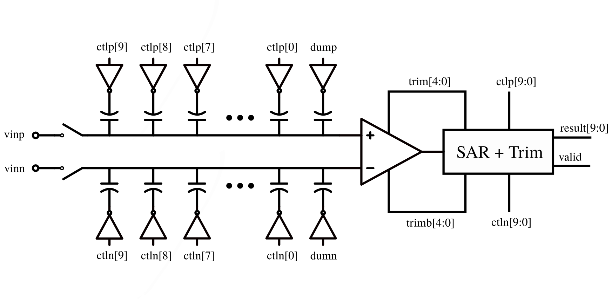
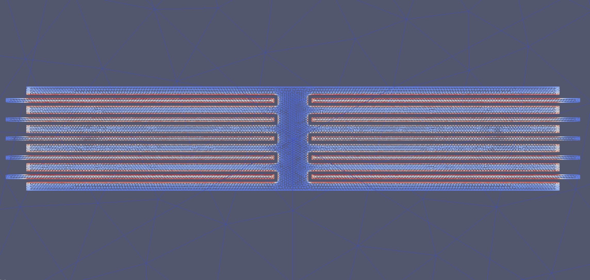
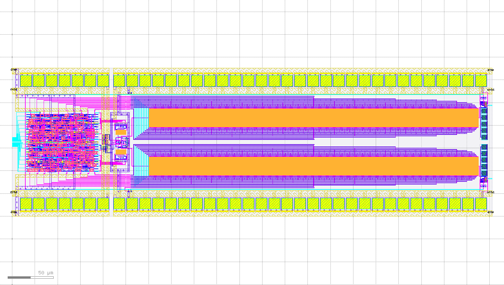
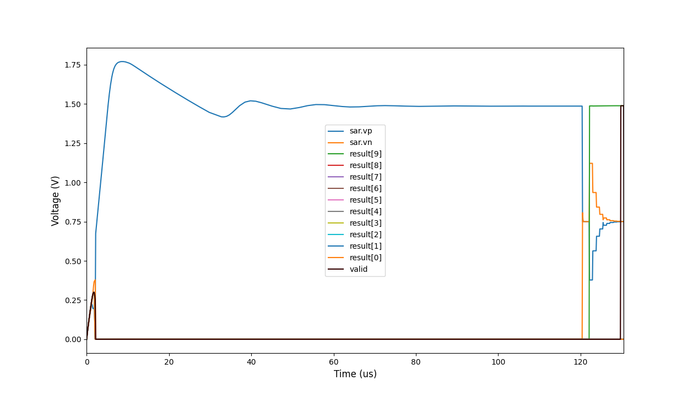

# 10 bit SAR-ADC + Analog Circuits

This submission features:

- 10b SAR-ADC on powered from external supply.
- 10b SAR-ADC powered from internal regulators.
- Bandgap reference.
- Testbuffer with multiplexer input.
- Clock generator
- 2 linear regulators, 1.2V and 1.5V.
- Bias current/voltage generator.

Included are:

- Hierachical GDS of the whole layout with all individual blocks.
- Schematics for all parts of the layout.
- Testbenches for all the individual blocks.
- Simulation corners setups for process corner simulations.

# Schematics

Simply source cadrc in the xschem folder and execute 
xschem afterwards to get an full overview.

# Layout

# ADC

The ADC is a differential 10 bit SAR, with a capacitative DAC.

## Comparator

The comparator is pretty standard single stage topology. It 
features a trim array to calibrate its input offset.

## Logic

The entire control logic is synthesized using the [openlane](https://github.com/The-OpenROAD-Project/OpenLane) flow.
This allows to easily integrate the trim logic for the 
comparator into the overall control logic block.

For faster simulation the ngspice mixed-mode xspice feature was used.
[Yosys](https://github.com/YosysHQ/yosys) can be used to synthesize a xspice 
compatible netlist that only uses code-model components (INV, NAND, NOT, DFF etc.) 
which speeds up simulation substantially.

## DAC

The DAC is a capacitative DAC made from a total of 1024 unit caps
per side. The DAC is top-plate sampled using a bootstrapped switch.

The unit size of the DAC elements is ~3fF based on FEM simulation carried out
with [Elmer FEM](https://github.com/ElmerCSC/elmerfem).
You can find the full simulation setup in the elmer subfolder of this repo.

The process is:

    - [klayout](https://www.klayout.de/) with [gds3xtrude](https://codeberg.org/tok/gds3xtrude) to get a stl mesh of the layout
    - [freecad](https://www.freecadweb.org/) to convert mesh to step and encapsulate layout in boundary.
    - [gmsh](https://gmsh.info/) to create a .msh 3D mesh from the step file.
    - ElmerMesh to convert the .msh file to Elmer compatible mesh.
    - ElmerGUI to define boundary conditions for the problem.
    - ElmerSolver to solve for the electric field, capacitance etc.
    - [Paraview](https://www.paraview.org/) to verify the solution.

## Layout

The complete SAR-ADC layout can be seen below. It occupies an area of approximately
0.08745 mm² (530 μm x 165 μm).

# Simulation

All parts have been simulated, using [ngspice](http://ngspice.sourceforge.net/), for PVT where relevant.

    - TT, SS, SF, FF, FS + Cmax, Cmin + Rmax, Rmin
    - Voltage +-10%
    - Temperature range -20° to 85°

To carry out PVT simulations, I used my custom [ngsim](https://github.com/chrische-xx/ngsim) 
python package that allows to manipulate spice netlists between runs. 

## Block Simulation

A lot of different simulations were carried out on the individual blocks. 
The testbenches can be found in the xschem/tb folder under the respective
block name.

## Top-Level Simulation

A complete extracted top-level simulation was carried out using a modified
PDK and [Xyce](https://github.com/Xyce/Xyce).

An example from system startup to completion of the first SAR conversion cycle
with zero differential input voltage can be seen below.

It shows the output voltage of the positive and negative DAC side.
This simulation utilizes all internal blocks, such a bandgap, ldo and oscillator
to operate the ADC.

# To be Continued...

If this project gets a place on the MPW6 shuttle, I will continue
to characterize the ASIC, using a opensource measurement flow.
The results will then be published on this page/repo

